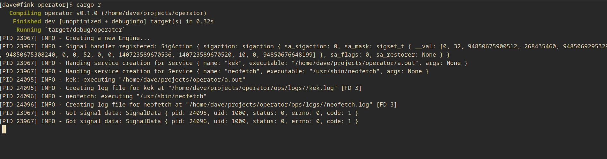

# Operator

simple service manager


# Services

Services are toml files stored in `/tmp/op`.

They contain the following format `/tmp/op/neofetch.toml`: 

```toml
name = "neofetch"
executable = "/usr/bin/neofetch"
```



